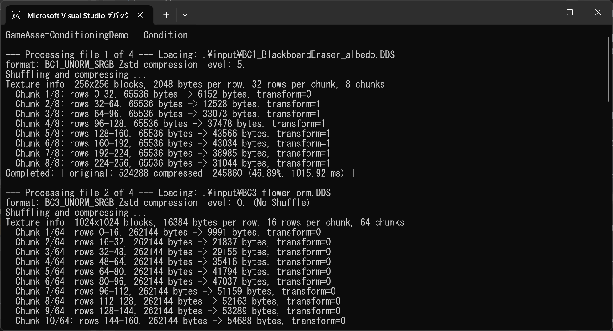
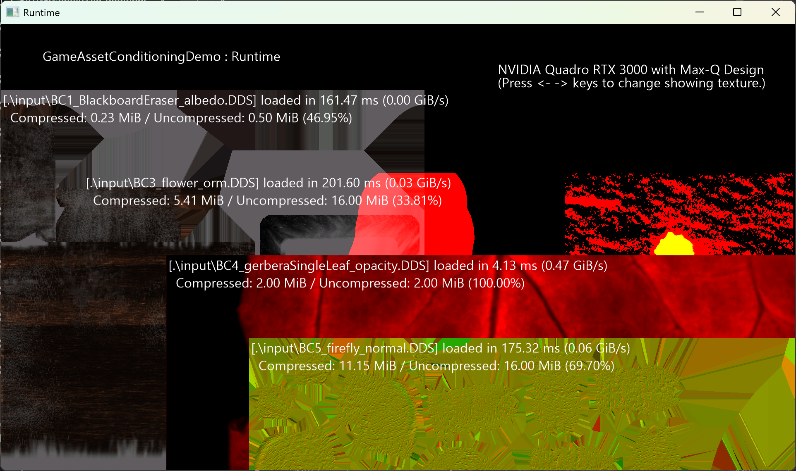
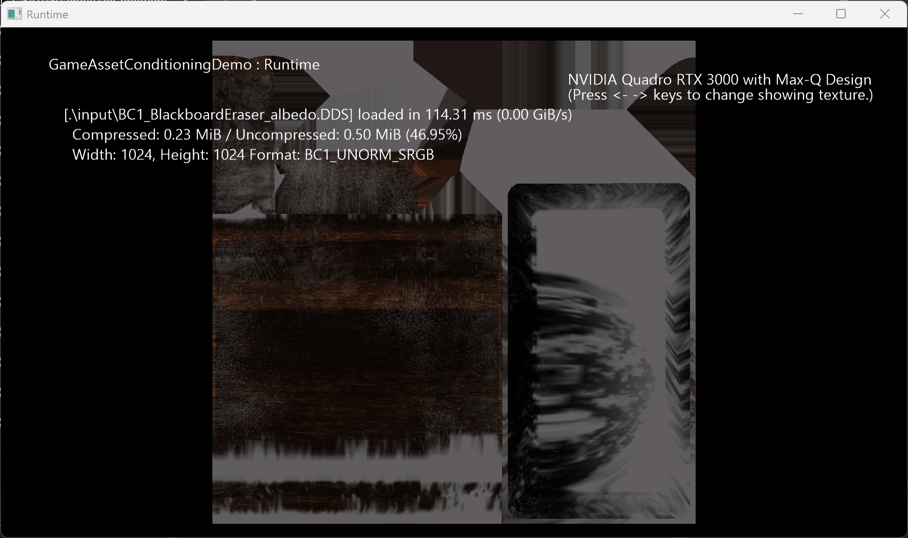

# Game Asset Conditioning Library Demo

This demo shows how to use the Game Asset Conditioning Library (GACL) with DirectStorage.

There are two projects here. One is to use GACL to shuffle multiple BCn textures and archive them. The another one loads archived file using DirectStorage and renders them.

Texture data is divided into chunks and loaded in parallel.

# Build

You need to build GACL first before building the demo.

1. Build [gacl.sln](../../gacl.sln) at first (debug/release).
2. Open [GameAssetConditioningDemo.sln](GameAssetConditioningDemo.sln)
3. Confirm NuGet DirectStorage version >= 1.4 in Runtime project.
4. Run `nuget restore GameAssetConditioningDemo.sln` to ensure that nuget dependencies are fetched for the project.
5. Build and run Condition project to create archive files.
6. Build and run Runtime project to load archive files and render them.

# Usage

## Conditioning Tool (Condition.exe)



At a minimum, you need an source directory and an destination directory. In the VS debugging, *"-list:.imagelist.txt -in:.Input -out:.output""* is passed.

```
Condition.exe -in:<src directory> -out:<dst directory> [options] 
```
### Options

```
-in:<src directory> = specify source directory.
-out:<dst directory> = specify destination directory.
-list:<file name> = specify image file list.(optional)
-zstdLevel:<n> = specify Zstd compression level (1 to 22). If not specified, the size will be adjusted automatically.(optional)
-zstdBlocksize:<n> = specify Zstd block size in bytes (1340 to 131072). If not specified, the size will be 8192 as default.(optional)
-nc = disable compression.(optional)
-ns = disable shuffle.(optional)
-chunksizeKB:<n> = set the chunk size for parallel loading to n KBytes (64 to 1024). Default is 512.(optional)
```

The application  can operate in one of two modes:

1. Directory mode: specify source and destination directories with `-in` and `-out` options. The tool processes all image files in the source directory. The specified options will be applied to all image files.
2. File list mode: specify a text file containing a list of image file names with the `-list` option, along with source directories. The tool processes only the files listed in the text file. In the list file, you can specify options for each image file.

This application  displays the compression ratio and the time it took to compress.

The image files in the input folder were copied from [TestImages](../../Assets/TestImages/InsectsDemo).

## Runtime Application (Runtime.exe)



This application expects an archive file created by the Conditioning Tool as an argument. During debugging in VS, *"..Condition\Output\shuffledTextures.bin"* is passed.

```
Runtime.exe <archive file> [-gpu-decompression { 0 | 1 }]
```
### Options

```
-gpu-decompression { 0 | 1 } = disable | enable GPU decompression. Default is enable. (optional)
```

### Controls

    Left key / Right key: Switch showing texture.



In this application, blocks divided into chunks for each texture are enqueued consecutively.

This application displays the compression rate and the time it took to load.

### Notes

With condition.exe, you can archive many textures, but Runtime.exe loads the number of textures specified by m_maxOnMemoryTextures in order from the beginning, ignoring the rest. the default is 4.

