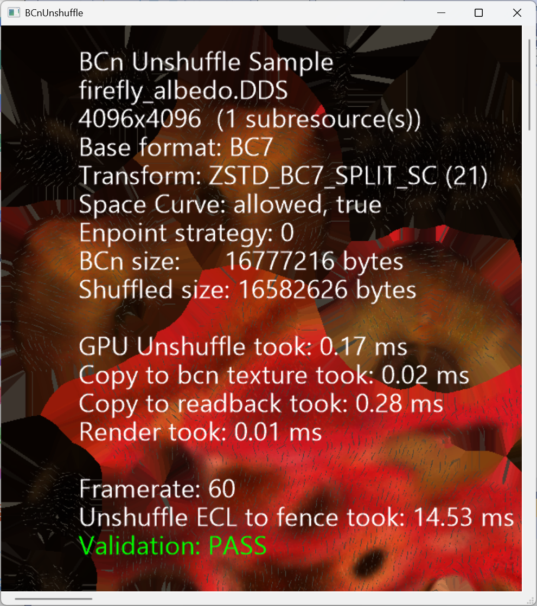

# Raw Shader Unshuffle Demo

This demo shows how to use the Game Asset Conditioning Library (GACL) using the underlying shaders to unshuffle textures at runtime.

# Build

You need to build GACL first before building the demo.

1. Build [gacl.sln](../../gacl.sln) at first (debug/release).
2. Open [RawShaderUnshuffle.sln](RawShaderUnshuffle.sln)
3. Run `nuget restore RawShaderUnshuffle.sln` to ensure that nuget dependencies are fetched for the project.
4. In the project properties add a debug argument "-path path-to-dds-file" to specify a BC1\\3\\4\\5\\7 file to consume.
5. Build and run project to load the DDS, shuffle it though GACL, and unshuffle using compute shaders, rendering the result.


# Usage

```

RawShaderUnshuffleDemo.exe -path <src file> [-warp] 

```

### Options


```

-path <src file> = Path to a BCn encoded dds file

-warp            = Force the sample to use WARP software rendering

```




